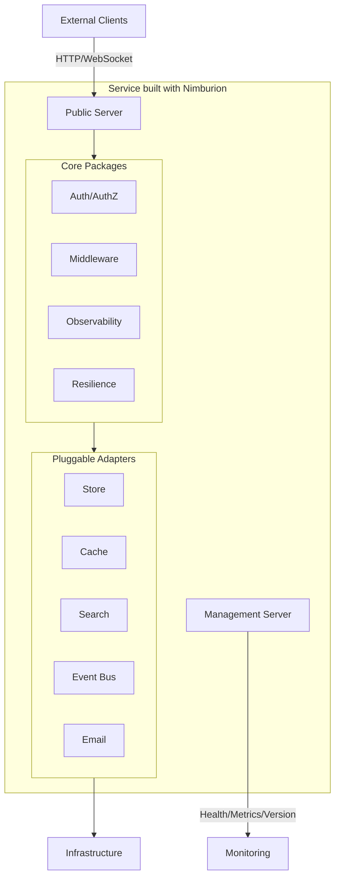

# Nimburion

Production-ready Go framework for building cloud-native microservices with strong defaults for security, observability, and operational reliability.

## What is Nimburion?

Nimburion provides a comprehensive set of packages and patterns for Go microservices that need to ship production-ready from day one. It standardizes runtime behavior, security, data access, messaging, and operations across your service fleet.

## Key Features

- **Dual HTTP Servers** - Separate public and management surfaces with independent lifecycle
- **Security Built-in** - OAuth2/OIDC JWT validation, scope-based authorization, security middleware
- **Pluggable Adapters** - SQL/NoSQL stores, cache, search, event bus, email with consistent interfaces
- **Full Observability** - Structured logging, metrics, distributed tracing, health checks
- **Resilience Patterns** - Timeout, rate limiting, circuit breaker, retry with sensible defaults
- **API Contract** - OpenAPI generation and request validation

## Quick Start

```bash
go get github.com/nimburion/nimburion
```

Create your first service in seconds:

```go
package main

import (
    "context"
    "net/http"
    
    "github.com/nimburion/nimburion/pkg/cli"
    "github.com/nimburion/nimburion/pkg/config"
    "github.com/nimburion/nimburion/pkg/observability/logger"
    "github.com/nimburion/nimburion/pkg/server"
)

func main() {
    opts := cli.ServiceCommandOptions{
        Name:        "my-service",
        Description: "My Nimburion service",
        RunServer: func(ctx context.Context, cfg *config.Config, log logger.Logger) error {
            httpOpts := server.NewDefaultRunHTTPServersOptions()
            httpOpts.Config = cfg
            httpOpts.Logger = log
            
            servers, err := server.BuildHTTPServers(httpOpts)
            if err != nil {
                return err
            }
            
            servers.Public.Router().GET("/hello", func(w http.ResponseWriter, r *http.Request) {
                w.Header().Set("Content-Type", "application/json")
                w.Write([]byte(`{"message":"Hello from Nimburion"}`))
            })
            
            return server.RunHTTPServersWithSignals(servers, httpOpts)
        },
    }
    
    cmd := cli.NewServiceCommand(opts)
    cli.Execute(cmd)
}
```

## Use Cases

**Greenfield Microservices**  
Start new services with production defaults from day one. No need to reinvent security, observability, or resilience patterns.

**Platform Standardization**  
Align existing services to shared platform contracts. Reduce operational variance across teams.

**Internal Platforms**  
Build reusable infrastructure building blocks with consistent interfaces and behavior.

## Architecture Overview



## Documentation Sections








## Community & Support

- **GitHub**: [github.com/nimburion/nimburion](https://github.com/nimburion/nimburion)
- **Issues**: Report bugs and request features on GitHub
- **Discussions**: Ask questions and share ideas in GitHub Discussions
