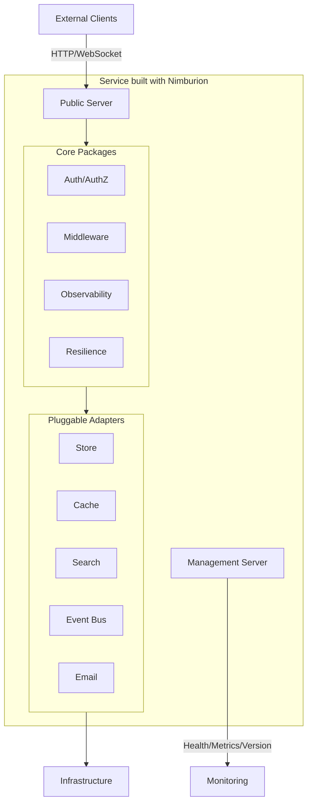

# Nimburion

Production-ready Go framework for building cloud-native microservices with strong defaults for security, observability, and operational reliability.

## What is Nimburion?

Nimburion provides a comprehensive set of packages and patterns for Go microservices that need to ship production-ready from day one. It standardizes runtime behavior, security, data access, messaging, and operations across your service fleet.

## Key Features

- **Dual HTTP Servers** - Separate public and management surfaces with independent lifecycle
- **Security Built-in** - OAuth2/OIDC JWT validation, scope-based authorization, security middleware
- **Pluggable Adapters** - SQL/NoSQL stores, cache, search, event bus, email with consistent interfaces
- **Full Observability** - Structured logging, metrics, distributed tracing, health checks
- **Resilience Patterns** - Timeout, rate limiting, circuit breaker, retry with sensible defaults
- **API Contract** - OpenAPI generation and request validation

## Quick Start

```bash
go get github.com/nimburion/nimburion
```

Create your first service in minutes:

```go
package main

import (
    "github.com/nimburion/nimburion/pkg/server"
    "github.com/nimburion/nimburion/pkg/config"
)

func main() {
    cfg := config.Load()
    
    pub := server.NewPublic(cfg)
    mgmt := server.NewManagement(cfg)
    
    pub.Router().GET("/hello", func(c *gin.Context) {
        c.JSON(200, gin.H{"message": "Hello from Nimburion"})
    })
    
    server.Run(pub, mgmt)
}
```

[Get started →](/documentation/nimburion/getting-started/)

## Use Cases

**Greenfield Microservices**  
Start new services with production defaults from day one. No need to reinvent security, observability, or resilience patterns.

**Platform Standardization**  
Align existing services to shared platform contracts. Reduce operational variance across teams.

**Internal Platforms**  
Build reusable infrastructure building blocks with consistent interfaces and behavior.

## Architecture Overview



## Documentation Sections

<div class="doc-sections-grid">
  <div class="doc-section-card">
    <h3>Getting Started</h3>
    <p>Installation, first service, configuration, deployment, and monitoring basics.</p>
    <a href="/documentation/nimburion/getting-started/">Start here →</a>
  </div>
  
  <div class="doc-section-card">
    <h3>Guides</h3>
    <p>Step-by-step guides for HTTP servers, auth, database access, events, jobs, and more.</p>
    <a href="/documentation/nimburion/guides/http-servers/">Browse guides →</a>
  </div>
  
  <div class="doc-section-card">
    <h3>Reference</h3>
    <p>Architecture details, configuration reference, middleware, adapters, and CLI commands.</p>
    <a href="/documentation/nimburion/reference/architecture/">View reference →</a>
  </div>
  
  <div class="doc-section-card">
    <h3>Packages</h3>
    <p>Detailed documentation for each package in the Nimburion ecosystem.</p>
    <a href="/documentation/nimburion/packages/">Explore packages →</a>
  </div>
</div>

## Community & Support

- **GitHub**: [github.com/nimburion/nimburion](https://github.com/nimburion/nimburion)
- **Issues**: Report bugs and request features on GitHub
- **Discussions**: Ask questions and share ideas in GitHub Discussions
