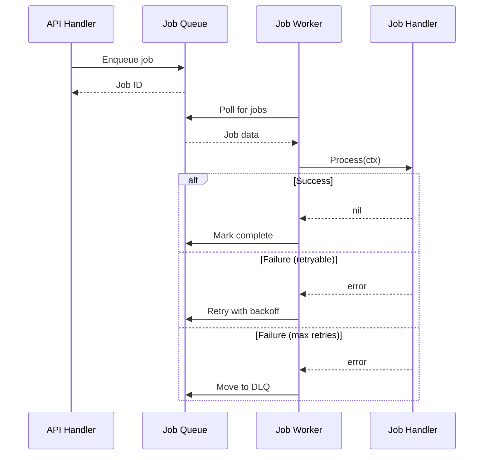

# Background Jobs

Guide to processing asynchronous background jobs with Nimburion's job system.

> **Note**: This guide uses simplified pseudocode examples. For working code, see the [Getting Started](/documentation/nimburion/getting-started/) guide.

## Overview

Nimburion provides a job processing system with:

- **Job queue** with pluggable backends (Redis, PostgreSQL, in-memory)
- **Cron-style scheduling** for recurring jobs
- **Automatic retries** with exponential backoff
- **Job status tracking** and monitoring
- **Concurrency control** per job type

## Configuration

Configure jobs in `config.yaml`:

```yaml
jobs:
  backend: redis
  redis:
    addr: localhost:6379
  concurrency: 10
  queues:
    - name: default
      priority: 1
    - name: critical
      priority: 10
    - name: low
      priority: 0
```

## Initialize Job System

```go
package main

import (
    "github.com/nimburion/nimburion/pkg/config"
    "github.com/nimburion/nimburion/pkg/jobs"
    "github.com/nimburion/nimburion/pkg/jobs/redis"
)

func main() {
    cfg := config.Load()
    
    // Create job backend
    backend, err := redis.New(cfg.Jobs.Redis)
    if err != nil {
        log.Fatal(err)
    }
    
    // Create job processor
    processor := jobs.NewProcessor(backend, cfg.Jobs)
    
    app := server.Bootstrap(cfg)
    app.SetJobProcessor(processor)
    app.Run()
}
```

## Define Job

```go
package jobs

import (
    "context"
    "fmt"
)

type SendEmailJob struct {
    To      string `json:"to"`
    Subject string `json:"subject"`
    Body    string `json:"body"`
}

func (j *SendEmailJob) Name() string {
    return "send_email"
}

func (j *SendEmailJob) Queue() string {
    return "default"
}

func (j *SendEmailJob) MaxRetries() int {
    return 3
}

func (j *SendEmailJob) Process(ctx context.Context) error {
    log.Printf("Sending email to %s: %s", j.To, j.Subject)
    
    // Send email via SMTP or email service
    if err := emailService.Send(j.To, j.Subject, j.Body); err != nil {
        return fmt.Errorf("failed to send email: %w", err)
    }
    
    log.Printf("Email sent successfully to %s", j.To)
    return nil
}
```

## Enqueue Job

```go
package handlers

import (
    "github.com/gin-gonic/gin"
    "github.com/nimburion/nimburion/pkg/jobs"
    myjobs "myapp/internal/jobs"
)

type UserHandler struct {
    repo      repository.UserRepository
    processor jobs.Processor
}

func (h *UserHandler) CreateUser(c *gin.Context) {
    var user User
    if err := c.ShouldBindJSON(&user); err != nil {
        c.JSON(400, gin.H{"error": err.Error()})
        return
    }
    
    // Save user
    if err := h.repo.Create(c.Request.Context(), &user); err != nil {
        c.JSON(500, gin.H{"error": "failed to create user"})
        return
    }
    
    // Enqueue welcome email job
    job := &myjobs.SendEmailJob{
        To:      user.Email,
        Subject: "Welcome to our platform!",
        Body:    fmt.Sprintf("Hi %s, welcome!", user.Name),
    }
    
    if err := h.processor.Enqueue(c.Request.Context(), job); err != nil {
        log.Printf("failed to enqueue job: %v", err)
        // Don't fail the request - job will be retried
    }
    
    c.JSON(201, user)
}
```

## Register Job Handlers

```go
package main

import (
    "github.com/nimburion/nimburion/pkg/jobs"
    myjobs "myapp/internal/jobs"
)

func main() {
    cfg := config.Load()
    backend, _ := redis.New(cfg.Jobs.Redis)
    processor := jobs.NewProcessor(backend, cfg.Jobs)
    
    // Register job handlers
    processor.Register("send_email", func(ctx context.Context, data []byte) error {
        var job myjobs.SendEmailJob
        if err := json.Unmarshal(data, &job); err != nil {
            return err
        }
        return job.Process(ctx)
    })
    
    processor.Register("generate_report", func(ctx context.Context, data []byte) error {
        var job myjobs.GenerateReportJob
        if err := json.Unmarshal(data, &job); err != nil {
            return err
        }
        return job.Process(ctx)
    })
    
    // Start processing
    if err := processor.Start(context.Background()); err != nil {
        log.Fatal(err)
    }
}
```

## Scheduled Jobs

Schedule recurring jobs with cron syntax:

```go
package main

import (
    "github.com/nimburion/nimburion/pkg/scheduler"
    myjobs "myapp/internal/jobs"
)

func main() {
    cfg := config.Load()
    processor := jobs.NewProcessor(backend, cfg.Jobs)
    sched := scheduler.New(processor)
    
    // Run daily at 2 AM
    sched.Schedule("0 2 * * *", &myjobs.DailyReportJob{})
    
    // Run every hour
    sched.Schedule("0 * * * *", &myjobs.CleanupJob{})
    
    // Run every 5 minutes
    sched.Schedule("*/5 * * * *", &myjobs.HealthCheckJob{})
    
    sched.Start()
}
```

## Job Lifecycle



## Retry Strategy

Configure retry behavior:

```go
type ProcessOrderJob struct {
    OrderID string `json:"orderId"`
}

func (j *ProcessOrderJob) MaxRetries() int {
    return 5
}

func (j *ProcessOrderJob) RetryBackoff() time.Duration {
    // Exponential backoff: 1s, 2s, 4s, 8s, 16s
    return time.Second
}

func (j *ProcessOrderJob) Process(ctx context.Context) error {
    // Transient errors will be retried
    if err := paymentService.Charge(j.OrderID); err != nil {
        if isTransientError(err) {
            return err // Will retry
        }
        return jobs.ErrPermanent(err) // Won't retry
    }
    return nil
}
```

## Job Priority

Enqueue jobs with priority:

```go
// High priority job
job := &SendEmailJob{To: "admin@example.com"}
processor.EnqueueWithPriority(ctx, job, jobs.PriorityHigh)

// Low priority job
job := &CleanupJob{}
processor.EnqueueWithPriority(ctx, job, jobs.PriorityLow)
```

Configure queue priorities:

```yaml
jobs:
  queues:
    - name: critical
      priority: 10
      concurrency: 5
    - name: default
      priority: 5
      concurrency: 10
    - name: low
      priority: 1
      concurrency: 2
```

## Job Status Tracking

Track job status:

```go
// Enqueue job and get ID
jobID, err := processor.EnqueueWithID(ctx, job)

// Check job status
status, err := processor.GetStatus(ctx, jobID)
fmt.Printf("Job %s: %s\n", jobID, status.State)

// States: pending, processing, completed, failed, retrying
```

## Delayed Jobs

Schedule jobs to run in the future:

```go
// Run in 1 hour
job := &SendReminderJob{UserID: "123"}
processor.EnqueueAt(ctx, job, time.Now().Add(1*time.Hour))

// Run after delay
processor.EnqueueAfter(ctx, job, 30*time.Minute)
```

## Job Middleware

Add middleware for logging, metrics, etc:

```go
processor.Use(func(next jobs.Handler) jobs.Handler {
    return func(ctx context.Context, data []byte) error {
        start := time.Now()
        
        err := next(ctx, data)
        
        duration := time.Since(start)
        log.Printf("Job completed in %v", duration)
        metrics.RecordJobDuration(duration)
        
        return err
    }
})
```

## Testing

Use in-memory backend for testing:

```go
import "github.com/nimburion/nimburion/pkg/jobs/memory"

func TestSendEmailJob(t *testing.T) {
    backend := memory.New()
    processor := jobs.NewProcessor(backend, jobs.Config{})
    
    processor.Register("send_email", func(ctx context.Context, data []byte) error {
        var job SendEmailJob
        json.Unmarshal(data, &job)
        return job.Process(ctx)
    })
    
    // Enqueue job
    job := &SendEmailJob{To: "test@example.com"}
    processor.Enqueue(context.Background(), job)
    
    // Process jobs synchronously in tests
    processor.ProcessOne(context.Background())
    
    // Verify job completed
    assert.Equal(t, 0, backend.PendingCount())
}
```

## Monitoring

Monitor job metrics:

```go
// Job queue size
metrics.Gauge("jobs.queue.size", processor.QueueSize())

// Job processing rate
metrics.Counter("jobs.processed.total")

// Job failures
metrics.Counter("jobs.failed.total")

// Job duration
metrics.Histogram("jobs.duration.seconds", duration)
```

## Best Practices

1. **Keep jobs idempotent** - Jobs may be retried
2. **Use timeouts** - Set context deadline for long-running jobs
3. **Handle errors properly** - Distinguish transient vs permanent errors
4. **Monitor queue depth** - Alert on growing queues
5. **Use appropriate priorities** - Critical jobs in high-priority queue
6. **Test job handlers** - Use in-memory backend for unit tests
7. **Log job progress** - Include job ID in logs for tracing

## Next Steps

- [Event-Driven Architecture](/documentation/nimburion/guides/event-driven/) - Trigger jobs from events
- [Observability](/documentation/nimburion/guides/observability/) - Monitor job processing
- [Jobs Package](/documentation/nimburion/packages/jobs/) - Full API reference
- [Scheduler Package](/documentation/nimburion/packages/scheduler/) - Cron scheduling
