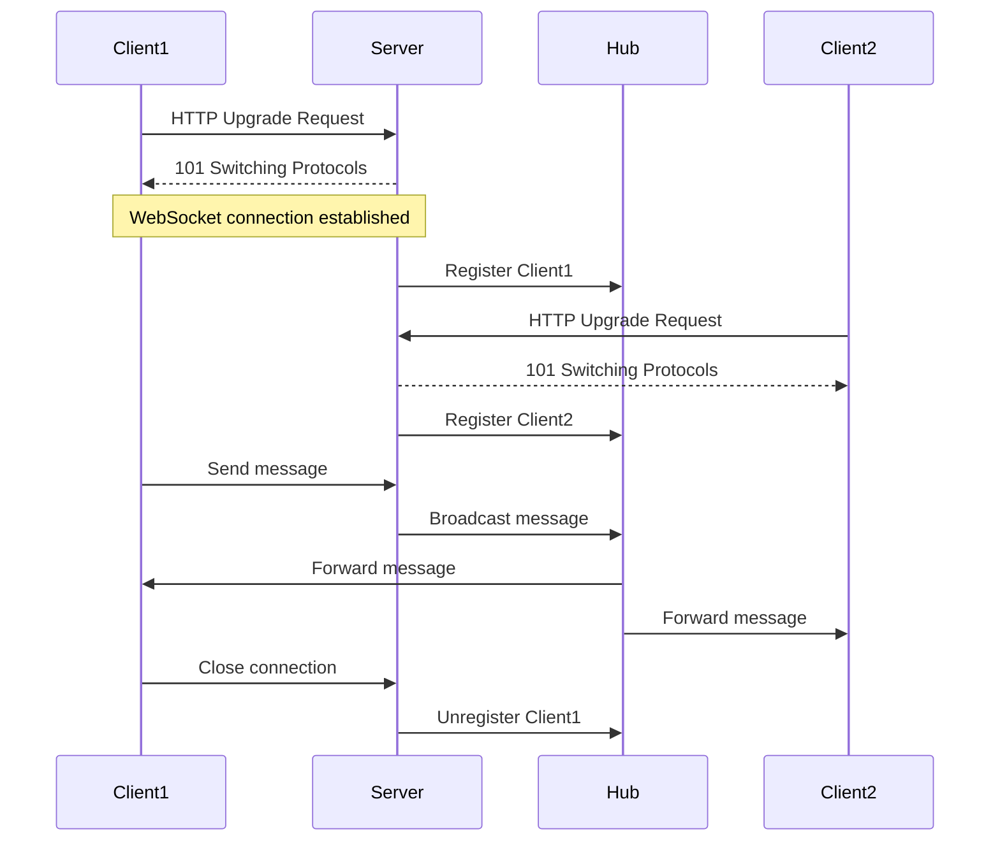

# Realtime Channels

Guide to building realtime features with Server-Sent Events (SSE) and WebSockets.

## Overview

Nimburion supports realtime communication through:

- **Server-Sent Events (SSE)** - Unidirectional server-to-client streaming
- **WebSockets** - Bidirectional full-duplex communication

## Server-Sent Events (SSE)

SSE provides server-to-client streaming over HTTP.

### Use Cases

- Live notifications
- Real-time dashboards
- Progress updates
- Live feeds

### Basic SSE Endpoint

```go
import "github.com/nimburion/nimburion/pkg/realtime"

func sseHandler(c *gin.Context) {
    // Create SSE stream
    stream := realtime.NewSSEStream(c.Writer)
    
    // Set headers
    c.Header("Content-Type", "text/event-stream")
    c.Header("Cache-Control", "no-cache")
    c.Header("Connection", "keep-alive")
    
    // Send events
    for i := 0; i < 10; i++ {
        event := realtime.Event{
            Data: fmt.Sprintf("Message %d", i),
        }
        
        if err := stream.Send(event); err != nil {
            return
        }
        
        time.Sleep(1 * time.Second)
    }
}

// Register endpoint
app.Public.GET("/events", sseHandler)
```

### Client-Side (JavaScript)

```javascript
const eventSource = new EventSource('/events');

eventSource.onmessage = (event) => {
    console.log('Received:', event.data);
};

eventSource.onerror = (error) => {
    console.error('SSE error:', error);
    eventSource.close();
};
```

### Named Events

```go
func sseHandler(c *gin.Context) {
    stream := realtime.NewSSEStream(c.Writer)
    
    // Send named events
    stream.Send(realtime.Event{
        Event: "user_joined",
        Data:  `{"userId": "123", "name": "Alice"}`,
    })
    
    stream.Send(realtime.Event{
        Event: "message",
        Data:  `{"text": "Hello!"}`,
    })
}
```

Client-side:
```javascript
eventSource.addEventListener('user_joined', (event) => {
    const data = JSON.parse(event.data);
    console.log('User joined:', data.name);
});

eventSource.addEventListener('message', (event) => {
    const data = JSON.parse(event.data);
    console.log('Message:', data.text);
});
```

### SSE with Event Bus

Stream events from event bus to clients:

```go
func notificationsHandler(c *gin.Context) {
    userID := auth.GetUserID(c)
    stream := realtime.NewSSEStream(c.Writer)
    
    // Subscribe to user notifications
    sub := eventBus.Subscribe(fmt.Sprintf("notifications.%s", userID))
    defer sub.Close()
    
    // Stream events to client
    for {
        select {
        case <-c.Request.Context().Done():
            return
        case msg := <-sub.Messages():
            stream.Send(realtime.Event{
                Event: "notification",
                Data:  string(msg.Payload),
            })
        }
    }
}
```

## WebSockets

WebSockets provide bidirectional communication.

### Use Cases

- Chat applications
- Collaborative editing
- Multiplayer games
- Live trading platforms

### Basic WebSocket Handler

```go
import (
    "github.com/gorilla/websocket"
    "github.com/nimburion/nimburion/pkg/realtime"
)

var upgrader = websocket.Upgrader{
    CheckOrigin: func(r *http.Request) bool {
        return true // Configure properly in production
    },
}

func wsHandler(c *gin.Context) {
    // Upgrade HTTP connection to WebSocket
    conn, err := upgrader.Upgrade(c.Writer, c.Request, nil)
    if err != nil {
        log.Printf("upgrade error: %v", err)
        return
    }
    defer conn.Close()
    
    // Handle messages
    for {
        messageType, message, err := conn.ReadMessage()
        if err != nil {
            log.Printf("read error: %v", err)
            break
        }
        
        log.Printf("received: %s", message)
        
        // Echo message back
        err = conn.WriteMessage(messageType, message)
        if err != nil {
            log.Printf("write error: %v", err)
            break
        }
    }
}

// Register endpoint
app.Public.GET("/ws", wsHandler)
```

### Client-Side (JavaScript)

```javascript
const ws = new WebSocket('ws://localhost:8080/ws');

ws.onopen = () => {
    console.log('Connected');
    ws.send('Hello Server!');
};

ws.onmessage = (event) => {
    console.log('Received:', event.data);
};

ws.onerror = (error) => {
    console.error('WebSocket error:', error);
};

ws.onclose = () => {
    console.log('Disconnected');
};
```

### WebSocket Hub

Manage multiple WebSocket connections:

```go
type Hub struct {
    clients    map[*Client]bool
    broadcast  chan []byte
    register   chan *Client
    unregister chan *Client
    mu         sync.RWMutex
}

type Client struct {
    hub  *Hub
    conn *websocket.Conn
    send chan []byte
}

func NewHub() *Hub {
    return &Hub{
        clients:    make(map[*Client]bool),
        broadcast:  make(chan []byte),
        register:   make(chan *Client),
        unregister: make(chan *Client),
    }
}

func (h *Hub) Run() {
    for {
        select {
        case client := <-h.register:
            h.mu.Lock()
            h.clients[client] = true
            h.mu.Unlock()
            
        case client := <-h.unregister:
            h.mu.Lock()
            if _, ok := h.clients[client]; ok {
                delete(h.clients, client)
                close(client.send)
            }
            h.mu.Unlock()
            
        case message := <-h.broadcast:
            h.mu.RLock()
            for client := range h.clients {
                select {
                case client.send <- message:
                default:
                    close(client.send)
                    delete(h.clients, client)
                }
            }
            h.mu.RUnlock()
        }
    }
}

func (c *Client) readPump() {
    defer func() {
        c.hub.unregister <- c
        c.conn.Close()
    }()
    
    for {
        _, message, err := c.conn.ReadMessage()
        if err != nil {
            break
        }
        c.hub.broadcast <- message
    }
}

func (c *Client) writePump() {
    defer c.conn.Close()
    
    for message := range c.send {
        err := c.conn.WriteMessage(websocket.TextMessage, message)
        if err != nil {
            break
        }
    }
}
```

### Chat Room Example

```go
type ChatRoom struct {
    hub     *Hub
    roomID  string
    clients map[string]*Client
}

func chatHandler(c *gin.Context) {
    roomID := c.Param("roomId")
    userID := auth.GetUserID(c)
    
    conn, err := upgrader.Upgrade(c.Writer, c.Request, nil)
    if err != nil {
        return
    }
    
    room := getOrCreateRoom(roomID)
    client := &Client{
        hub:  room.hub,
        conn: conn,
        send: make(chan []byte, 256),
    }
    
    room.hub.register <- client
    
    // Notify others
    room.hub.broadcast <- []byte(fmt.Sprintf("%s joined", userID))
    
    go client.writePump()
    go client.readPump()
}
```

## WebSocket Flow



## Presence Tracking

Track online users:

```go
type PresenceTracker struct {
    users map[string]*UserPresence
    mu    sync.RWMutex
}

type UserPresence struct {
    UserID    string
    Status    string
    LastSeen  time.Time
    Conn      *websocket.Conn
}

func (p *PresenceTracker) UserOnline(userID string, conn *websocket.Conn) {
    p.mu.Lock()
    defer p.mu.Unlock()
    
    p.users[userID] = &UserPresence{
        UserID:   userID,
        Status:   "online",
        LastSeen: time.Now(),
        Conn:     conn,
    }
    
    // Broadcast presence update
    p.broadcastPresence(userID, "online")
}

func (p *PresenceTracker) UserOffline(userID string) {
    p.mu.Lock()
    defer p.mu.Unlock()
    
    if user, ok := p.users[userID]; ok {
        user.Status = "offline"
        user.LastSeen = time.Now()
    }
    
    p.broadcastPresence(userID, "offline")
}

func (p *PresenceTracker) GetOnlineUsers() []string {
    p.mu.RLock()
    defer p.mu.RUnlock()
    
    var online []string
    for userID, user := range p.users {
        if user.Status == "online" {
            online = append(online, userID)
        }
    }
    return online
}
```

## Message Types

Define typed messages:

```go
type Message struct {
    Type    string          `json:"type"`
    Payload json.RawMessage `json:"payload"`
}

type ChatMessage struct {
    UserID  string `json:"userId"`
    Text    string `json:"text"`
    SentAt  string `json:"sentAt"`
}

type TypingIndicator struct {
    UserID string `json:"userId"`
    Typing bool   `json:"typing"`
}

func handleMessage(conn *websocket.Conn, data []byte) {
    var msg Message
    if err := json.Unmarshal(data, &msg); err != nil {
        return
    }
    
    switch msg.Type {
    case "chat":
        var chat ChatMessage
        json.Unmarshal(msg.Payload, &chat)
        handleChatMessage(conn, &chat)
        
    case "typing":
        var typing TypingIndicator
        json.Unmarshal(msg.Payload, &typing)
        handleTypingIndicator(conn, &typing)
    }
}
```

## Authentication

Authenticate WebSocket connections:

```go
func wsHandler(c *gin.Context) {
    // Verify token from query param
    token := c.Query("token")
    claims, err := auth.VerifyToken(token)
    if err != nil {
        c.JSON(401, gin.H{"error": "unauthorized"})
        return
    }
    
    conn, err := upgrader.Upgrade(c.Writer, c.Request, nil)
    if err != nil {
        return
    }
    
    client := &Client{
        userID: claims.Subject,
        conn:   conn,
        send:   make(chan []byte),
    }
    
    // Handle authenticated connection
    handleClient(client)
}
```

## Best Practices

1. **Use SSE for unidirectional streaming** - Simpler than WebSockets
2. **Use WebSockets for bidirectional** - Chat, collaborative editing
3. **Authenticate connections** - Verify tokens before upgrade
4. **Handle disconnections gracefully** - Clean up resources
5. **Implement heartbeat/ping** - Detect dead connections
6. **Limit message size** - Prevent memory exhaustion
7. **Rate limit messages** - Prevent abuse
8. **Use message queues** - Buffer messages for offline users

## Next Steps

- [Event-Driven Architecture](/documentation/nimburion/guides/event-driven/) - Integrate with event bus
- [Authentication](/documentation/nimburion/guides/authentication/) - Secure realtime connections
- [Realtime Package](/documentation/nimburion/packages/realtime/) - Full API reference
