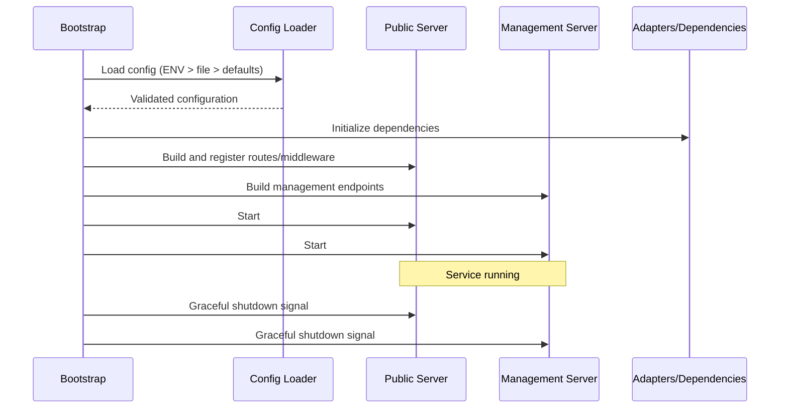
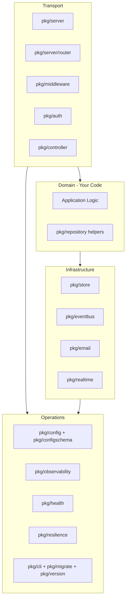

# Architecture

Technical architecture and design principles of the Nimburion framework.

## Runtime Model

Nimburion services follow a consistent lifecycle:

1. **Load Configuration** - `ENV > file > defaults` precedence
2. **Build Servers** - Create public and management HTTP servers
3. **Attach Components** - Register routes, middleware, handlers, adapters
4. **Start Servers** - Run both servers with lifecycle hooks
5. **Graceful Shutdown** - Handle SIGTERM/SIGINT, drain connections, cleanup

## Runtime Flow



## Architectural Boundaries

Nimburion organizes code into clear layers:

### Transport Layer
HTTP routing, middleware, request/response handling, and protocol concerns.

**Packages**: `pkg/server`, `pkg/server/router`, `pkg/middleware`, `pkg/auth`, `pkg/controller`

### Domain Layer
Business workflows, orchestration, and application logic. Not provided by Nimburion - this is your code.

**Packages**: Your application code, optionally using `pkg/repository` for data access patterns

### Infrastructure Layer
Datastore, cache, search, messaging, email adapters with pluggable implementations.

**Packages**: `pkg/store`, `pkg/eventbus`, `pkg/email`, `pkg/realtime`

### Operations Layer
Observability, health checks, resilience primitives, and operational tooling.

**Packages**: `pkg/config`, `pkg/configschema`, `pkg/observability`, `pkg/health`, `pkg/resilience`, `pkg/cli`, `pkg/migrate`, `pkg/version`

## Boundary Diagram



## Package Organization

### Core Runtime
- **pkg/server** - HTTP server lifecycle, graceful shutdown, lifecycle hooks
- **pkg/server/router** - Routing abstraction (currently Gin-based)
- **pkg/config** - Configuration loading with precedence
- **pkg/configschema** - Configuration schema helpers

### Security & Middleware
- **pkg/middleware** - HTTP middleware (CORS, request ID, logging, recovery)
- **pkg/auth** - OAuth2/OIDC JWT validation, scope authorization
- **pkg/controller** - HTTP controller helpers

### Data Access
- **pkg/store** - Database adapter interfaces (SQL, NoSQL)
- **pkg/repository** - Repository pattern helpers and base implementations

### Messaging & Jobs
- **pkg/eventbus** - Event bus adapters (Kafka, RabbitMQ, SQS)
- **pkg/jobs** - Background job processing runtime
- **pkg/scheduler** - Job scheduling

### Communication
- **pkg/realtime** - SSE and WebSocket support
- **pkg/email** - Email sending with pluggable providers

### Observability
- **pkg/observability** - Structured logging, metrics, distributed tracing
- **pkg/health** - Health check registration and execution
- **pkg/resilience** - Circuit breaker, retry, timeout, rate limiting

### Utilities
- **pkg/i18n** - Internationalization support
- **pkg/migrate** - Database migration helpers
- **pkg/cli** - CLI utilities
- **pkg/version** - Version information

## Design Principles

### Pluggable by Default
All infrastructure dependencies use adapter interfaces. Swap SQL databases, cache providers, or message brokers without changing business logic.

### Operations First-Class
Health checks, metrics, logging, and tracing are built into the framework, not bolted on later.

### Secure by Default
Authentication and authorization middleware ready to use. Security is not optional.

### Graceful Degradation
Circuit breakers, timeouts, and retry logic with sensible defaults. Services fail gracefully under load.

### Configuration as Code
Type-safe configuration with validation. Environment variables, files, and defaults with clear precedence.

## Extension Points

### Custom Middleware
```go
func MyMiddleware() gin.HandlerFunc {
    return func(c *gin.Context) {
        // Before request
        c.Next()
        // After request
    }
}

pub.Use(MyMiddleware())
```

### Custom Health Checks
```go
mgmt.AddHealthCheck("database", func() error {
    return db.Ping()
})
```

### Custom Adapters
Implement adapter interfaces:
- `store.Adapter` for databases
- `eventbus.Adapter` for message brokers
- `email.Provider` for email services

## Next Steps

- [Configuration Reference](/documentation/nimburion/reference/configuration/) - All configuration options
- [Middleware Reference](/documentation/nimburion/reference/middleware/) - Available middleware
- [Adapters Reference](/documentation/nimburion/reference/adapters/) - Adapter interfaces

