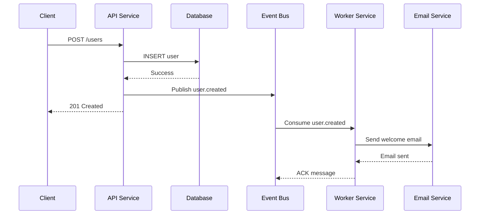

# Event-Driven Architecture

Guide to building event-driven microservices with Nimburion's event bus adapters.

> **Note**: This guide uses simplified pseudocode examples. For working code, see the [Getting Started](/documentation/nimburion/getting-started/) guide.

## Overview

Nimburion provides pluggable event bus adapters for asynchronous messaging:

- **Kafka** - High-throughput distributed streaming
- **RabbitMQ** - Flexible message broker with routing
- **AWS SQS** - Managed queue service
- **In-Memory** - For testing and development

## Configuration

Configure event bus in `config.yaml`:

```yaml
eventbus:
  type: kafka
  brokers:
    - localhost:9092
  groupId: my-service
  topics:
    - user.created
    - user.updated
    - order.placed
```

## Initialize Event Bus

```go
package main

import (
    "github.com/nimburion/nimburion/pkg/config"
    "github.com/nimburion/nimburion/pkg/eventbus"
    "github.com/nimburion/nimburion/pkg/eventbus/kafka"
)

func main() {
    cfg := config.Load()
    
    // Create event bus adapter
    bus, err := kafka.New(cfg.EventBus)
    if err != nil {
        log.Fatal(err)
    }
    defer bus.Close()
    
    app := server.Bootstrap(cfg)
    app.SetEventBus(bus)
    app.Run()
}
```

## Publishing Events

### Define Event

```go
package events

import "time"

type UserCreated struct {
    UserID    string    `json:"userId"`
    Email     string    `json:"email"`
    Name      string    `json:"name"`
    CreatedAt time.Time `json:"createdAt"`
}

func (e UserCreated) Topic() string {
    return "user.created"
}

func (e UserCreated) Key() string {
    return e.UserID
}
```

### Publish Event

```go
package handlers

import (
    "github.com/gin-gonic/gin"
    "github.com/nimburion/nimburion/pkg/eventbus"
    "myapp/internal/events"
)

type UserHandler struct {
    repo repository.UserRepository
    bus  eventbus.EventBus
}

func (h *UserHandler) CreateUser(c *gin.Context) {
    var user User
    if err := c.ShouldBindJSON(&user); err != nil {
        c.JSON(400, gin.H{"error": err.Error()})
        return
    }
    
    // Save to database
    if err := h.repo.Create(c.Request.Context(), &user); err != nil {
        c.JSON(500, gin.H{"error": "failed to create user"})
        return
    }
    
    // Publish event
    event := events.UserCreated{
        UserID:    user.ID,
        Email:     user.Email,
        Name:      user.Name,
        CreatedAt: user.CreatedAt,
    }
    
    if err := h.bus.Publish(c.Request.Context(), event); err != nil {
        log.Printf("failed to publish event: %v", err)
        // Don't fail the request - event will be retried
    }
    
    c.JSON(201, user)
}
```

## Consuming Events

### Register Event Handler

```go
package main

import (
    "context"
    "github.com/nimburion/nimburion/pkg/eventbus"
    "myapp/internal/events"
)

func main() {
    cfg := config.Load()
    bus, _ := kafka.New(cfg.EventBus)
    
    // Register handler for user.created events
    bus.Subscribe("user.created", handleUserCreated)
    
    // Start consuming
    if err := bus.Start(context.Background()); err != nil {
        log.Fatal(err)
    }
}

func handleUserCreated(ctx context.Context, msg eventbus.Message) error {
    var event events.UserCreated
    if err := msg.Decode(&event); err != nil {
        return err
    }
    
    log.Printf("User created: %s (%s)", event.Name, event.Email)
    
    // Process event
    // - Send welcome email
    // - Create user profile
    // - Update analytics
    
    return nil
}
```

### Error Handling

```go
func handleUserCreated(ctx context.Context, msg eventbus.Message) error {
    var event events.UserCreated
    if err := msg.Decode(&event); err != nil {
        // Decoding error - skip message
        log.Printf("failed to decode event: %v", err)
        return nil
    }
    
    // Process event
    if err := processUser(ctx, &event); err != nil {
        // Processing error - retry
        return err
    }
    
    return nil
}
```

## Event Flow Diagram



## Transactional Outbox Pattern

Ensure events are published reliably using the outbox pattern:

```go
package repository

import (
    "context"
    "github.com/nimburion/nimburion/pkg/store"
)

type UserRepository struct {
    db store.Store
}

func (r *UserRepository) CreateWithEvent(ctx context.Context, user *User, event interface{}) error {
    tx, err := r.db.Begin(ctx)
    if err != nil {
        return err
    }
    defer tx.Rollback()
    
    // Insert user
    _, err = tx.Exec(ctx,
        "INSERT INTO users (id, name, email) VALUES ($1, $2, $3)",
        user.ID, user.Name, user.Email,
    )
    if err != nil {
        return err
    }
    
    // Insert event to outbox
    eventData, _ := json.Marshal(event)
    _, err = tx.Exec(ctx,
        "INSERT INTO outbox (id, topic, payload, created_at) VALUES ($1, $2, $3, $4)",
        uuid.New(), "user.created", eventData, time.Now(),
    )
    if err != nil {
        return err
    }
    
    return tx.Commit()
}
```

Outbox processor:

```go
func processOutbox(ctx context.Context, db store.Store, bus eventbus.EventBus) {
    ticker := time.NewTicker(5 * time.Second)
    defer ticker.Stop()
    
    for {
        select {
        case <-ctx.Done():
            return
        case <-ticker.C:
            rows, err := db.Query(ctx,
                "SELECT id, topic, payload FROM outbox ORDER BY created_at LIMIT 100",
            )
            if err != nil {
                log.Printf("failed to query outbox: %v", err)
                continue
            }
            
            for rows.Next() {
                var id, topic string
                var payload []byte
                rows.Scan(&id, &topic, &payload)
                
                // Publish event
                if err := bus.PublishRaw(ctx, topic, payload); err != nil {
                    log.Printf("failed to publish event: %v", err)
                    continue
                }
                
                // Delete from outbox
                db.Exec(ctx, "DELETE FROM outbox WHERE id = $1", id)
            }
            rows.Close()
        }
    }
}
```

## Idempotency

Handle duplicate events with idempotency keys:

```go
func handleUserCreated(ctx context.Context, msg eventbus.Message) error {
    var event events.UserCreated
    msg.Decode(&event)
    
    // Check if already processed
    exists, err := db.QueryRow(ctx,
        "SELECT EXISTS(SELECT 1 FROM processed_events WHERE event_id = $1)",
        msg.ID(),
    ).Scan(&exists)
    
    if exists {
        log.Printf("event already processed: %s", msg.ID())
        return nil
    }
    
    // Process event
    if err := processUser(ctx, &event); err != nil {
        return err
    }
    
    // Mark as processed
    _, err = db.Exec(ctx,
        "INSERT INTO processed_events (event_id, processed_at) VALUES ($1, $2)",
        msg.ID(), time.Now(),
    )
    
    return err
}
```

## Dead Letter Queue

Configure DLQ for failed messages:

```yaml
eventbus:
  type: kafka
  brokers:
    - localhost:9092
  deadLetterTopic: dlq
  maxRetries: 3
```

Handle DLQ messages:

```go
bus.Subscribe("dlq", func(ctx context.Context, msg eventbus.Message) error {
    log.Printf("DLQ message: topic=%s, error=%s", msg.Topic(), msg.Error())
    
    // Alert ops team
    // Store for manual review
    // Attempt recovery
    
    return nil
})
```

## Testing

Use in-memory event bus for testing:

```go
import "github.com/nimburion/nimburion/pkg/eventbus/memory"

func TestUserCreation(t *testing.T) {
    bus := memory.New()
    handler := NewUserHandler(repo, bus)
    
    // Create user
    handler.CreateUser(ctx, req)
    
    // Verify event published
    events := bus.GetPublished("user.created")
    assert.Len(t, events, 1)
    
    var event UserCreated
    events[0].Decode(&event)
    assert.Equal(t, "alice@example.com", event.Email)
}
```

## Best Practices

1. **Use idempotency keys** - Handle duplicate events gracefully
2. **Implement outbox pattern** - Ensure reliable event publishing
3. **Version your events** - Add version field for schema evolution
4. **Use dead letter queues** - Handle poison messages
5. **Monitor lag** - Track consumer lag and processing time
6. **Partition by key** - Use consistent keys for ordering
7. **Handle errors properly** - Retry transient errors, skip permanent errors

## Next Steps

- [Background Jobs](/documentation/nimburion/guides/background-jobs/) - Async job processing
- [Observability](/documentation/nimburion/guides/observability/) - Monitor event processing
- [EventBus Package](/documentation/nimburion/packages/eventbus/) - Full API reference
