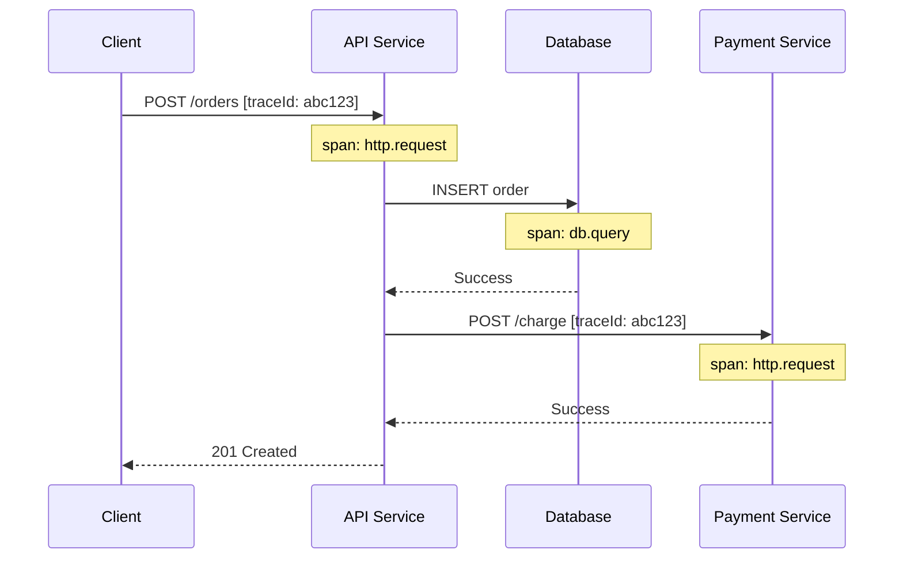

# Observability

Complete guide to logging, metrics, and tracing in Nimburion services.

## Overview

Nimburion provides built-in observability through three pillars:

- **Structured Logging** - JSON logs with context and correlation
- **Metrics** - Prometheus metrics for monitoring
- **Distributed Tracing** - OpenTelemetry for request tracing

## Structured Logging

### Configuration

```yaml
log:
  level: info          # debug, info, warn, error
  format: json         # json, console
  output: stdout       # stdout, stderr, file
  file: /var/log/app.log
```

### Log Levels

```go
import "github.com/nimburion/nimburion/pkg/observability/log"

// Debug - detailed information for debugging
log.Debug("processing request", "userId", userID, "action", "login")

// Info - general informational messages
log.Info("user logged in", "userId", userID)

// Warn - warning messages for potentially harmful situations
log.Warn("rate limit approaching", "userId", userID, "requests", 95)

// Error - error messages for failures
log.Error("failed to process payment", "error", err, "orderId", orderID)
```

### Structured Fields

```go
log.Info("user created",
    "userId", user.ID,
    "email", user.Email,
    "source", "api",
    "duration", duration.Milliseconds(),
)
```

Output:
```json
{
  "level": "info",
  "msg": "user created",
  "userId": "123",
  "email": "alice@example.com",
  "source": "api",
  "duration": 45,
  "timestamp": "2026-02-26T18:00:00Z",
  "requestId": "req-abc123"
}
```

### Context-Aware Logging

```go
import "github.com/nimburion/nimburion/pkg/observability/log"

func handleRequest(c *gin.Context) {
    // Get logger with request context
    logger := log.FromContext(c.Request.Context())
    
    logger.Info("processing request")
    
    // Logger automatically includes:
    // - requestId
    // - traceId
    // - spanId
    // - userId (if authenticated)
}
```

### Logger Middleware

Bootstrap automatically adds logging middleware:

```go
// Logs all HTTP requests
app.Public.Use(middleware.Logger())
```

Log output:
```json
{
  "level": "info",
  "msg": "http request",
  "method": "POST",
  "path": "/users",
  "status": 201,
  "duration": 45,
  "requestId": "req-abc123",
  "ip": "192.168.1.1",
  "userAgent": "curl/7.64.1"
}
```

## Metrics

### Automatic Metrics

Bootstrap automatically collects:

- `http_requests_total` - Total HTTP requests by method, path, status
- `http_request_duration_seconds` - Request duration histogram
- `http_requests_in_flight` - Current in-flight requests
- `go_goroutines` - Number of goroutines
- `go_memstats_alloc_bytes` - Allocated memory

### Custom Metrics

```go
import "github.com/nimburion/nimburion/pkg/observability/metrics"

// Counter - monotonically increasing value
var userCreatedCounter = metrics.NewCounter(
    "users_created_total",
    "Total number of users created",
)

userCreatedCounter.Inc()

// Gauge - value that can go up or down
var activeUsersGauge = metrics.NewGauge(
    "active_users",
    "Number of currently active users",
)

activeUsersGauge.Set(float64(count))
activeUsersGauge.Inc()
activeUsersGauge.Dec()

// Histogram - distribution of values
var requestSizeHistogram = metrics.NewHistogram(
    "request_size_bytes",
    "HTTP request size in bytes",
    []float64{100, 1000, 10000, 100000},
)

requestSizeHistogram.Observe(float64(size))

// Summary - similar to histogram with quantiles
var responseSizeSummary = metrics.NewSummary(
    "response_size_bytes",
    "HTTP response size in bytes",
)

responseSizeSummary.Observe(float64(size))
```

### Metrics with Labels

```go
var requestCounter = metrics.NewCounterVec(
    "http_requests_total",
    "Total HTTP requests",
    []string{"method", "path", "status"},
)

requestCounter.WithLabelValues("POST", "/users", "201").Inc()
```

### Business Metrics

```go
// Track business KPIs
var orderValueHistogram = metrics.NewHistogram(
    "order_value_dollars",
    "Order value in dollars",
    []float64{10, 50, 100, 500, 1000},
)

orderValueHistogram.Observe(order.Total)

var subscriptionGauge = metrics.NewGaugeVec(
    "active_subscriptions",
    "Active subscriptions by plan",
    []string{"plan"},
)

subscriptionGauge.WithLabelValues("premium").Inc()
```

### Metrics Endpoint

Metrics are exposed on the management server:

```bash
curl http://localhost:9090/metrics
```

Output (Prometheus format):
```
# HELP http_requests_total Total HTTP requests
# TYPE http_requests_total counter
http_requests_total{method="GET",path="/users",status="200"} 1523

# HELP http_request_duration_seconds HTTP request duration
# TYPE http_request_duration_seconds histogram
http_request_duration_seconds_bucket{le="0.1"} 1234
http_request_duration_seconds_bucket{le="0.5"} 1456
http_request_duration_seconds_sum 678.9
http_request_duration_seconds_count 1523
```

## Distributed Tracing

### Configuration

```yaml
tracing:
  enabled: true
  exporter: otlp
  endpoint: http://jaeger:4318
  serviceName: my-service
  sampleRate: 1.0  # 1.0 = 100%, 0.1 = 10%
```

### Automatic Tracing

Bootstrap automatically traces:
- HTTP requests
- Database queries
- Event bus operations
- Job processing

### Manual Spans

```go
import "github.com/nimburion/nimburion/pkg/observability/tracing"

func processOrder(ctx context.Context, order *Order) error {
    // Create span
    ctx, span := tracing.StartSpan(ctx, "process_order")
    defer span.End()
    
    // Add attributes
    span.SetAttribute("order.id", order.ID)
    span.SetAttribute("order.total", order.Total)
    
    // Process order
    if err := validateOrder(ctx, order); err != nil {
        span.RecordError(err)
        span.SetStatus(tracing.StatusError, "validation failed")
        return err
    }
    
    if err := chargePayment(ctx, order); err != nil {
        span.RecordError(err)
        return err
    }
    
    span.SetStatus(tracing.StatusOK, "order processed")
    return nil
}

func validateOrder(ctx context.Context, order *Order) error {
    ctx, span := tracing.StartSpan(ctx, "validate_order")
    defer span.End()
    
    // Validation logic
    return nil
}
```

### Trace Propagation

Traces automatically propagate across:
- HTTP requests (via headers)
- Event bus messages (via metadata)
- Background jobs (via context)

```go
// Outgoing HTTP request
req, _ := http.NewRequestWithContext(ctx, "GET", url, nil)
// Trace context automatically injected in headers

// Event publishing
bus.Publish(ctx, event)
// Trace context included in event metadata

// Job enqueueing
processor.Enqueue(ctx, job)
// Trace context preserved in job
```

### Trace Visualization



## Observability Stack

### Logging Stack

```yaml
# Collect logs with Fluentd/Fluent Bit
# Store in Elasticsearch
# Visualize with Kibana

log:
  format: json
  output: stdout
```

### Metrics Stack

```yaml
# Scrape metrics with Prometheus
# Visualize with Grafana
# Alert with Alertmanager

management:
  port: 9090  # Prometheus scrapes /metrics
```

Prometheus config:
```yaml
scrape_configs:
  - job_name: 'my-service'
    static_configs:
      - targets: ['localhost:9090']
```

### Tracing Stack

```yaml
# Export traces to Jaeger/Tempo
# Visualize in Jaeger UI

tracing:
  enabled: true
  endpoint: http://jaeger:4318
```

## Correlation

All three pillars are correlated via IDs:

```json
{
  "level": "info",
  "msg": "processing order",
  "requestId": "req-abc123",
  "traceId": "trace-xyz789",
  "spanId": "span-def456",
  "orderId": "order-123"
}
```

Query flow:
1. Find error in logs by `requestId`
2. Get `traceId` from log entry
3. View full trace in Jaeger
4. Check metrics for that time period

## Best Practices

1. **Use structured logging** - Always use key-value pairs
2. **Include context** - Add requestId, userId, traceId to logs
3. **Log at appropriate levels** - Debug for dev, Info for prod
4. **Don't log sensitive data** - Mask PII, passwords, tokens
5. **Use metrics for aggregation** - Don't log every request
6. **Sample traces in production** - 1-10% sample rate
7. **Set up alerts** - Alert on error rate, latency, queue depth
8. **Create dashboards** - Visualize key metrics

## Example Dashboard

Key metrics to monitor:

```
- Request rate (requests/sec)
- Error rate (errors/sec, %)
- Latency (p50, p95, p99)
- Active connections
- Queue depth
- Job processing rate
- Database query time
- Memory usage
- CPU usage
```

## Next Steps

- [Resilience](/documentation/nimburion/guides/resilience/) - Handle failures gracefully
- [Deployment](/documentation/nimburion/getting-started/deployment/) - Production setup
- [Observability Package](/documentation/nimburion/packages/observability/) - Full API reference
