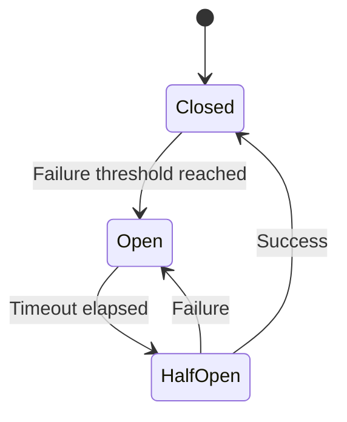
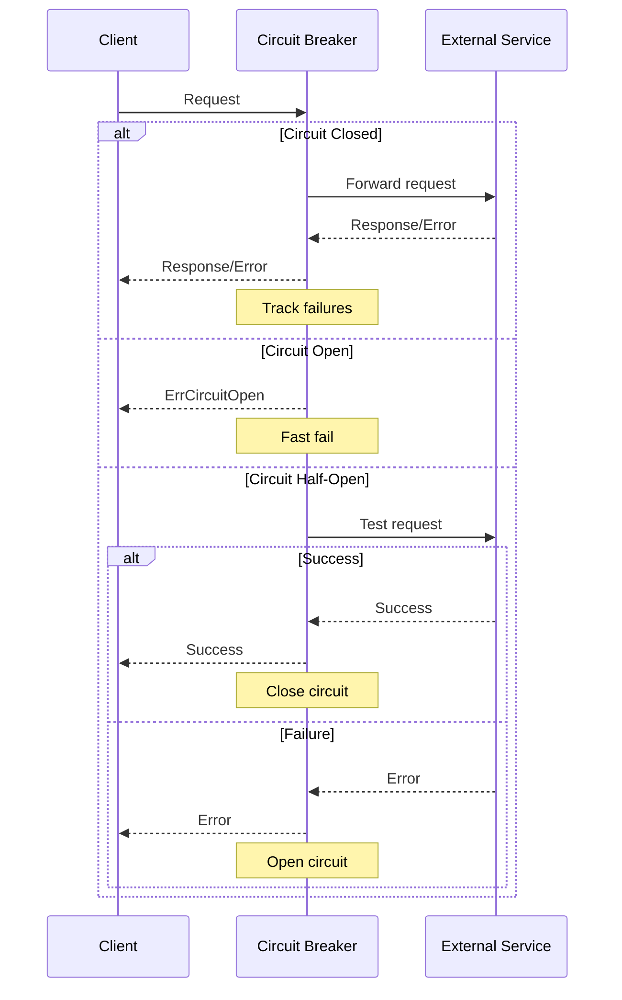
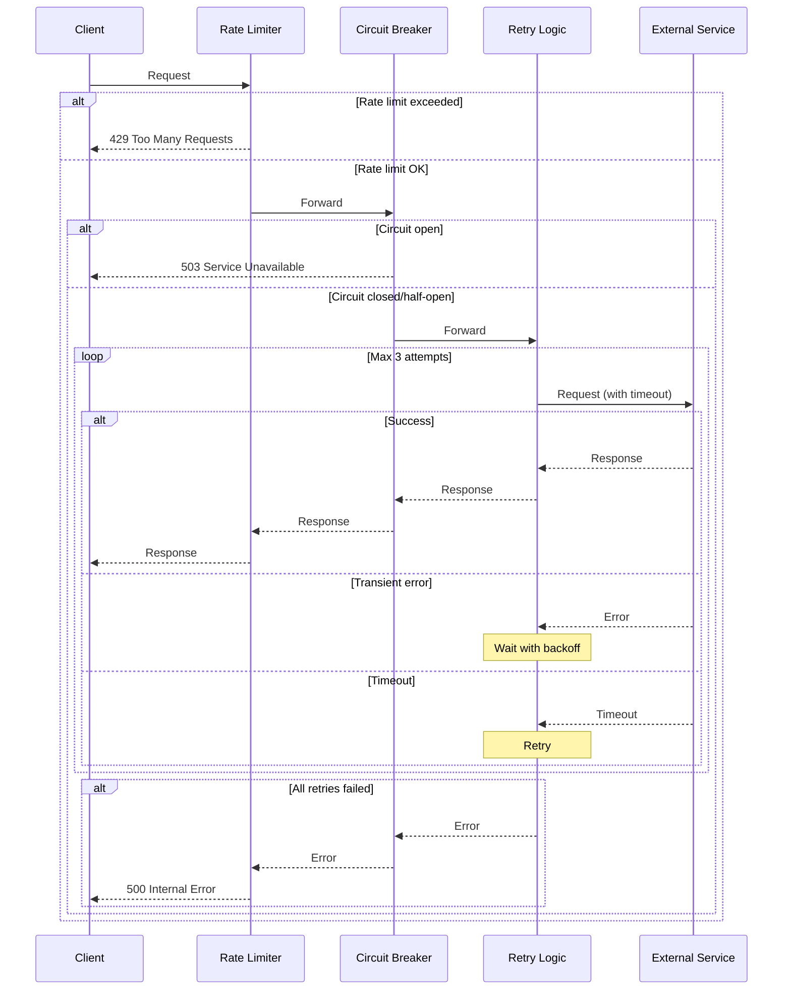

# Resilience Patterns

Guide to building resilient services with circuit breakers, retries, timeouts, and rate limiting.

## Overview

Nimburion provides resilience patterns to handle failures gracefully:

- **Circuit Breaker** - Prevent cascade failures
- **Retry** - Automatic retry with exponential backoff
- **Timeout** - Request deadline enforcement
- **Rate Limiting** - Protect against overload

## Circuit Breaker

Prevents cascade failures by stopping requests to failing services.

### States



### Configuration

```yaml
resilience:
  circuitBreaker:
    maxRequests: 3        # Max requests in half-open state
    interval: 60s         # Interval to clear counts
    timeout: 30s          # Time to wait before half-open
    failureThreshold: 5   # Failures to open circuit
```

### Usage

```go
import "github.com/nimburion/nimburion/pkg/resilience"

// Create circuit breaker
cb := resilience.NewCircuitBreaker(resilience.CircuitBreakerConfig{
    MaxRequests:      3,
    Interval:         60 * time.Second,
    Timeout:          30 * time.Second,
    FailureThreshold: 5,
})

// Wrap function call
result, err := cb.Execute(func() (interface{}, error) {
    return externalAPI.Call()
})

if err == resilience.ErrCircuitOpen {
    // Circuit is open, use fallback
    return fallbackResponse()
}
```

### HTTP Client with Circuit Breaker

```go
type ResilientClient struct {
    client *http.Client
    cb     *resilience.CircuitBreaker
}

func (c *ResilientClient) Get(url string) (*http.Response, error) {
    result, err := c.cb.Execute(func() (interface{}, error) {
        return c.client.Get(url)
    })
    
    if err == resilience.ErrCircuitOpen {
        return nil, fmt.Errorf("service unavailable")
    }
    
    if err != nil {
        return nil, err
    }
    
    return result.(*http.Response), nil
}
```

### Circuit Breaker Flow



## Retry

Automatic retry with exponential backoff and jitter.

### Configuration

```go
retryConfig := resilience.RetryConfig{
    MaxAttempts:  3,
    InitialDelay: 100 * time.Millisecond,
    MaxDelay:     5 * time.Second,
    Multiplier:   2.0,
    Jitter:       true,
}
```

### Usage

```go
import "github.com/nimburion/nimburion/pkg/resilience"

// Retry with exponential backoff
err := resilience.Retry(ctx, retryConfig, func() error {
    return externalAPI.Call()
})

if err != nil {
    log.Printf("all retries failed: %v", err)
}
```

### Conditional Retry

```go
err := resilience.RetryIf(ctx, retryConfig, 
    func() error {
        return externalAPI.Call()
    },
    func(err error) bool {
        // Only retry on transient errors
        return isTransientError(err)
    },
)
```

### Retry Backoff Timeline

```
Attempt 1: 0ms
Attempt 2: 100ms + jitter
Attempt 3: 200ms + jitter
Attempt 4: 400ms + jitter
Attempt 5: 800ms + jitter (capped at maxDelay)
```

## Timeout

Enforce request deadlines to prevent hanging requests.

### Context Timeout

```go
import "context"

// Set timeout on context
ctx, cancel := context.WithTimeout(context.Background(), 5*time.Second)
defer cancel()

// Pass context to operations
result, err := db.Query(ctx, "SELECT * FROM users")
if err == context.DeadlineExceeded {
    log.Println("query timed out")
}
```

### HTTP Client Timeout

```go
client := &http.Client{
    Timeout: 10 * time.Second,
}

resp, err := client.Get(url)
if err != nil {
    if os.IsTimeout(err) {
        log.Println("request timed out")
    }
}
```

### Middleware Timeout

```go
import "github.com/nimburion/nimburion/pkg/middleware"

// Add timeout middleware
app.Public.Use(middleware.Timeout(30 * time.Second))

// Handler will be cancelled after 30s
app.Public.GET("/slow", func(c *gin.Context) {
    select {
    case <-c.Request.Context().Done():
        c.JSON(408, gin.H{"error": "request timeout"})
        return
    case result := <-processRequest():
        c.JSON(200, result)
    }
})
```

## Rate Limiting

Protect services from overload with rate limiting.

### Token Bucket Algorithm

```go
import "github.com/nimburion/nimburion/pkg/resilience"

// Create rate limiter: 100 requests per second
limiter := resilience.NewRateLimiter(100, time.Second)

// Check if request is allowed
if !limiter.Allow() {
    return errors.New("rate limit exceeded")
}

// Process request
processRequest()
```

### Per-User Rate Limiting

```go
type RateLimiterMiddleware struct {
    limiters map[string]*resilience.RateLimiter
    mu       sync.RWMutex
}

func (m *RateLimiterMiddleware) Limit(requestsPerSecond int) gin.HandlerFunc {
    return func(c *gin.Context) {
        userID := auth.GetUserID(c)
        
        m.mu.RLock()
        limiter, exists := m.limiters[userID]
        m.mu.RUnlock()
        
        if !exists {
            m.mu.Lock()
            limiter = resilience.NewRateLimiter(requestsPerSecond, time.Second)
            m.limiters[userID] = limiter
            m.mu.Unlock()
        }
        
        if !limiter.Allow() {
            c.JSON(429, gin.H{"error": "rate limit exceeded"})
            c.Abort()
            return
        }
        
        c.Next()
    }
}
```

### Middleware Usage

```go
import "github.com/nimburion/nimburion/pkg/middleware"

// Global rate limit: 1000 req/s
app.Public.Use(middleware.RateLimit(1000))

// Per-endpoint rate limit
app.Public.GET("/expensive", 
    middleware.RateLimit(10),
    expensiveHandler,
)
```

## Combined Patterns

Use multiple patterns together:

```go
type ResilientService struct {
    client  *http.Client
    cb      *resilience.CircuitBreaker
    limiter *resilience.RateLimiter
}

func (s *ResilientService) Call(ctx context.Context, url string) (*Response, error) {
    // Check rate limit
    if !s.limiter.Allow() {
        return nil, errors.New("rate limit exceeded")
    }
    
    // Set timeout
    ctx, cancel := context.WithTimeout(ctx, 5*time.Second)
    defer cancel()
    
    // Execute with circuit breaker and retry
    var result *Response
    err := resilience.Retry(ctx, retryConfig, func() error {
        res, err := s.cb.Execute(func() (interface{}, error) {
            req, _ := http.NewRequestWithContext(ctx, "GET", url, nil)
            return s.client.Do(req)
        })
        
        if err != nil {
            return err
        }
        
        result = parseResponse(res.(*http.Response))
        return nil
    })
    
    return result, err
}
```

## Resilience Flow



## Bulkhead Pattern

Isolate resources to prevent cascade failures:

```go
import "github.com/nimburion/nimburion/pkg/resilience"

// Create bulkhead with max 10 concurrent requests
bulkhead := resilience.NewBulkhead(10, 100) // 10 concurrent, 100 queue

// Execute with bulkhead
err := bulkhead.Execute(func() error {
    return processRequest()
})

if err == resilience.ErrBulkheadFull {
    return errors.New("service overloaded")
}
```

## Fallback Pattern

Provide fallback responses when primary fails:

```go
func getUserProfile(userID string) (*Profile, error) {
    // Try primary source
    profile, err := primaryDB.GetProfile(userID)
    if err == nil {
        return profile, nil
    }
    
    // Try cache fallback
    profile, err = cache.GetProfile(userID)
    if err == nil {
        log.Println("using cached profile")
        return profile, nil
    }
    
    // Return default profile
    log.Println("using default profile")
    return &Profile{
        ID:   userID,
        Name: "Unknown User",
    }, nil
}
```

## Monitoring

Track resilience metrics:

```go
// Circuit breaker state
metrics.Gauge("circuit_breaker.state", cb.State())

// Retry attempts
metrics.Counter("retry.attempts.total")

// Rate limit rejections
metrics.Counter("rate_limit.rejected.total")

// Timeout errors
metrics.Counter("timeout.errors.total")
```

## Best Practices

1. **Use circuit breakers for external services** - Prevent cascade failures
2. **Retry only transient errors** - Don't retry validation errors
3. **Add jitter to retries** - Prevent thundering herd
4. **Set appropriate timeouts** - Balance responsiveness and success rate
5. **Monitor resilience metrics** - Track circuit breaker state, retry rate
6. **Use bulkheads** - Isolate critical resources
7. **Implement fallbacks** - Degrade gracefully
8. **Test failure scenarios** - Chaos engineering

## Next Steps

- [Observability](/documentation/nimburion/guides/observability/) - Monitor resilience patterns
- [Deployment](/documentation/nimburion/getting-started/deployment/) - Production configuration
- [Resilience Package](/documentation/nimburion/packages/resilience/) - Full API reference
