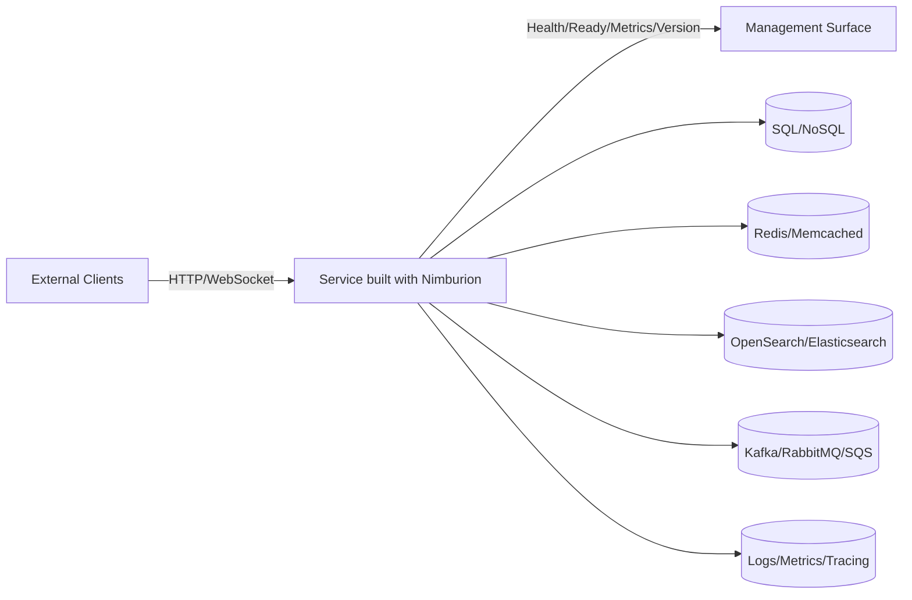

# Overview

Nimburion is a production-ready Go framework for building cloud-native microservices with consistent architecture, security, and operational patterns.

## Objectives

**Reduce Bootstrap Time**  
Eliminate repeated boilerplate and service setup. Start with production defaults from day one.

**Standardize Runtime Behavior**  
Keep security, observability, and reliability patterns consistent across teams and services.

**First-Class Operations**  
Make monitoring, health checks, and operational concerns built-in, not bolted-on.

## Use Cases

### Greenfield Microservices
Build new services that need production defaults from day one. No need to reinvent security, observability, or resilience patterns.

### Platform Standardization
Align existing services to shared platform contracts. Reduce operational variance and improve maintainability.

### Internal Platforms
Expose reusable infrastructure building blocks with consistent interfaces and behavior across your organization.

## System Context

## Capability Matrix

| Area | What Nimburion Provides |
|------|------------------------|
| **Runtime** | Public + management servers, graceful shutdown, lifecycle hooks |
| **Security** | OAuth2/OIDC JWT validation, scope authorization, security middleware |
| **Data** | Pluggable adapters for SQL/NoSQL, cache, search with consistent interfaces |
| **Messaging** | Event bus adapters (Kafka, RabbitMQ, SQS), outbox/idempotency helpers |
| **Observability** | Structured logging, metrics, distributed tracing, health/readiness endpoints |
| **Reliability** | Timeout, rate limit, circuit breaker, retry patterns with sensible defaults |
| **API Contract** | OpenAPI generation and request validation |

## Core Capabilities

### Dual HTTP Servers
Run separate public and management servers with independent ports, middleware, and lifecycle. Keep operational endpoints isolated from business traffic.

### Security Built-in
OAuth2/OIDC JWT validation, scope-based authorization, and security middleware ready to use. No need to implement auth from scratch.

### Pluggable Adapters
Consistent interfaces for SQL/NoSQL stores, cache, search, event bus, and email. Swap implementations without changing business logic.

### Full Observability
Structured logging, Prometheus metrics, OpenTelemetry tracing, and health checks built into the framework. Monitor your services from day one.

### Resilience Patterns
Timeout, rate limiting, circuit breaker, and retry patterns with sensible defaults. Build reliable services without reinventing resilience.

### API Contract
Generate OpenAPI specs from code and validate requests automatically. Keep your API documentation in sync with implementation.

## Next Steps

- [Get started](/documentation/nimburion/getting-started/) - Install and create your first service
- [Architecture](/documentation/nimburion/reference/architecture/) - Understand the runtime model and boundaries
- [Guides](/documentation/nimburion/guides/http-servers/) - Learn how to use specific features
