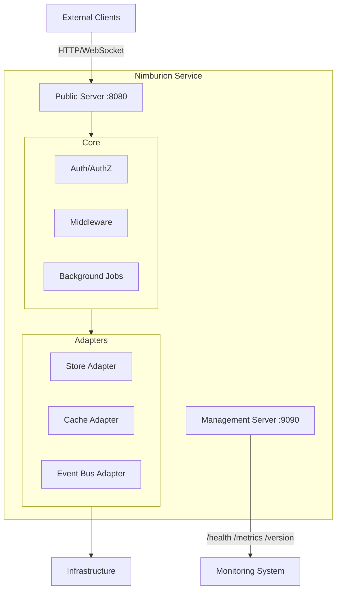

# Overview

Nimburion is a production-ready Go framework for building cloud-native microservices with consistent architecture, security, and operational patterns.

## What is Nimburion?

A comprehensive Go framework that provides the building blocks for production-grade microservices. Nimburion eliminates boilerplate, standardizes patterns, and ships with security, observability, and resilience built-in.

## Core Philosophy

**Production-Ready from Day One**  
Services built with Nimburion include health checks, metrics, structured logging, and graceful shutdown out of the box.

**Convention over Configuration**  
Sensible defaults for security, observability, and resilience. Override when needed, but start with battle-tested patterns.

**Pluggable Architecture**  
Swap databases, caches, message brokers, or email providers without changing business logic. Consistent interfaces across all adapters.

## Key Capabilities

### Dual HTTP Servers
Separate public and management servers with independent ports and middleware. Keep operational endpoints isolated from business traffic.

- Public server for business endpoints (default: 8080)
- Management server for health, metrics, version (default: 9090)
- Independent lifecycle and middleware chains
- Graceful shutdown with configurable timeout

### Security Built-in
OAuth2/OIDC JWT validation and scope-based authorization ready to use.

- JWT token validation with issuer verification
- Scope-based access control
- Security middleware (CORS, rate limiting, request validation)
- No need to implement auth from scratch

### Pluggable Adapters
Consistent interfaces for infrastructure dependencies.

- **Store**: SQL (PostgreSQL, MySQL) and NoSQL (MongoDB, DynamoDB)
- **Cache**: Redis, Memcached
- **Search**: OpenSearch, Elasticsearch
- **Event Bus**: Kafka, RabbitMQ, AWS SQS
- **Email**: SMTP, SendGrid, AWS SES

### Full Observability
Structured logging, Prometheus metrics, and OpenTelemetry tracing.

- JSON structured logging with configurable levels
- Prometheus metrics for HTTP requests, latency, errors
- OpenTelemetry distributed tracing
- Health and readiness checks with custom probes

### Resilience Patterns
Circuit breaker, retry, timeout, and rate limiting with sensible defaults.

- Circuit breaker to prevent cascade failures
- Exponential backoff retry with jitter
- Request timeout and deadline propagation
- Rate limiting per endpoint or globally

### Background Jobs
Async job processing with scheduling, retries, and monitoring.

- Job queue with pluggable backends
- Cron-style scheduling
- Automatic retries with backoff
- Job status tracking and metrics

## System Context



## Use Cases

### Greenfield Microservices
Start new services with production defaults. No need to reinvent security, observability, or resilience patterns.

**Best for**: Teams building new services that need to ship quickly without compromising on production readiness.

### Platform Standardization
Align existing services to shared platform contracts. Reduce operational variance across teams.

**Best for**: Platform teams establishing standards across multiple services and teams.

### Internal Developer Platforms
Build reusable infrastructure building blocks with consistent interfaces.

**Best for**: Organizations creating internal platforms with standardized service templates.

## Requirements

- **Go**: 1.23 or later
- **Scaffolding**: Use `nimbctl` to generate service boilerplate
- **Dependencies**: Managed via Go modules

## Quick Example

Generate a new service with `nimbctl`:

```bash
nimbctl new my-service
cd my-service
```

The generated service includes:

```go
package main

import (
    "github.com/nimburion/nimburion/pkg/server"
    "github.com/nimburion/nimburion/pkg/config"
)

func main() {
    cfg := config.Load()
    
    // Bootstrap automatically creates and configures both servers
    app := server.Bootstrap(cfg)
    
    // Register your routes
    app.Public.GET("/hello", func(c *gin.Context) {
        c.JSON(200, gin.H{"message": "Hello from Nimburion"})
    })
    
    // Run with graceful shutdown
    app.Run()
}
```

What you get automatically:
- Public server on port 8080
- Management server on port 9090 with `/health`, `/ready`, `/metrics`, `/version`
- Structured JSON logging
- Prometheus metrics
- Graceful shutdown on SIGTERM/SIGINT
- Configuration from ENV, file, or defaults

## Architecture Layers

| Layer | Responsibility | Nimburion Packages |
|-------|---------------|-------------------|
| **Transport** | HTTP routing, middleware, request/response | `server`, `middleware`, `auth` |
| **Domain** | Business logic and workflows | Your application code |
| **Infrastructure** | Data access, messaging, external services | `store`, `eventbus`, `email`, `realtime` |
| **Operations** | Config, logging, metrics, health checks | `config`, `observability`, `health`, `resilience` |

## What Nimburion Provides

✅ HTTP server lifecycle and routing  
✅ Configuration management with precedence  
✅ Authentication and authorization  
✅ Database and cache adapters  
✅ Event bus and background jobs  
✅ Structured logging and metrics  
✅ Health checks and graceful shutdown  
✅ Circuit breaker and retry logic  
✅ OpenAPI generation  

## What You Provide

📝 Business logic and domain models  
📝 API endpoints and handlers  
📝 Database schemas and migrations  
📝 Event handlers and job workers  
📝 Service-specific configuration  

## Next Steps

<div class="doc-sections-grid">
  <div class="doc-section-card">
    <h3>Getting Started</h3>
    <p>Install nimbctl, generate your first service, and deploy it.</p>
    <a href="{{ '/documentation/nimburion/getting-started/' | relative_url }}">Start here →</a>
  </div>
  
  <div class="doc-section-card">
    <h3>Architecture</h3>
    <p>Understand the runtime model, boundaries, and design principles.</p>
    <a href="{{ '/documentation/nimburion/reference/architecture/' | relative_url }}">Learn more →</a>
  </div>
  
  <div class="doc-section-card">
    <h3>Guides</h3>
    <p>Step-by-step guides for HTTP servers, auth, database, events, and more.</p>
    <a href="{{ '/documentation/nimburion/guides/http-servers/' | relative_url }}">Browse guides →</a>
  </div>
  
  <div class="doc-section-card">
    <h3>Packages</h3>
    <p>Detailed API documentation for each package in the ecosystem.</p>
    <a href="{{ '/documentation/nimburion/packages/' | relative_url }}">Explore packages →</a>
  </div>
</div>
