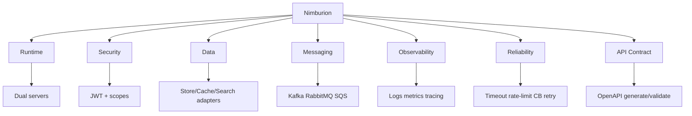

# Nimburion Overview

Nimburion is a reusable Go framework for building production-grade microservices with consistent architecture and operations.

## Objectives
- Reduce service bootstrap time and repeated boilerplate
- Standardize runtime behavior across teams
- Keep security, observability, and reliability first-class

## Use Cases
- Greenfield microservices that need production defaults from day one
- Existing services being aligned to shared platform contracts
- Platform teams exposing reusable infrastructure building blocks

## System Context

## Capability Matrix

<table>
  <thead>
    <tr>
      <th>Area</th>
      <th>What Nimburion provides</th>
    </tr>
  </thead>
  <tbody>
    <tr><td>Runtime</td><td>Public + management servers, graceful shutdown</td></tr>
    <tr><td>Security</td><td>OAuth2/OIDC JWT validation, scope authorization, security middleware</td></tr>
    <tr><td>Data</td><td>Pluggable adapters for SQL/NoSQL, cache, search</td></tr>
    <tr><td>Messaging</td><td>Event bus adapters (Kafka, RabbitMQ, SQS), outbox/idempotency helpers</td></tr>
    <tr><td>Observability</td><td>Structured logging, metrics, tracing, health/readiness endpoints</td></tr>
    <tr><td>Reliability</td><td>Timeout, rate limit, circuit breaker, retry patterns</td></tr>
    <tr><td>API Contract</td><td>OpenAPI generation and request validation</td></tr>
  </tbody>
</table>

## Capability Map

