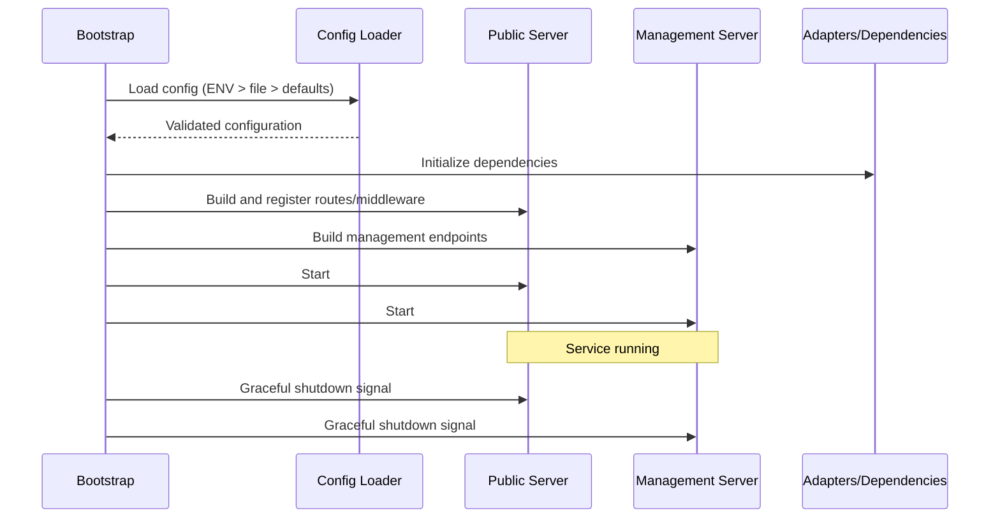
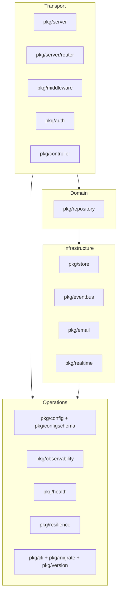

# Nimburion Architecture

## Runtime Model
1. Load configuration (`ENV > file > defaults`)
2. Build public and management servers
3. Attach router, middleware, handlers, and adapters
4. Start both servers with lifecycle hooks
5. Expose management endpoints and perform graceful shutdown

## Runtime Flow

## Boundaries
- Transport layer: HTTP routing, middleware, request/response concerns
- Domain/application layer: business workflows and orchestration
- Infrastructure layer: datastore, cache, search, messaging, email adapters
- Operations layer: observability, health checks, resilience primitives

## Boundary Diagram

## Main Packages (Current)
- `pkg/server`, `pkg/server/router`: server and router abstraction
- `pkg/config`, `pkg/configschema`: config loading and validation helpers
- `pkg/middleware`, `pkg/auth`: security and request pipeline
- `pkg/controller`, `pkg/repository`: transport helpers and data abstraction
- `pkg/store`, `pkg/eventbus`, `pkg/email`: pluggable integrations
- `pkg/observability`, `pkg/health`, `pkg/resilience`: runtime operations
- `pkg/realtime`: SSE/WebSocket support
- `pkg/cli`, `pkg/migrate`, `pkg/version`: service tooling

## Out of Scope for This Page
- Long implementation snippets
- Detailed property-by-property formal proofs
- Deep test internals

## Related pages
- [Index](./index.md)
- [Overview](./overview.md)
- [Operations](./operations.md)
