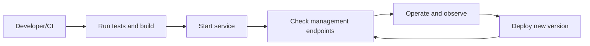
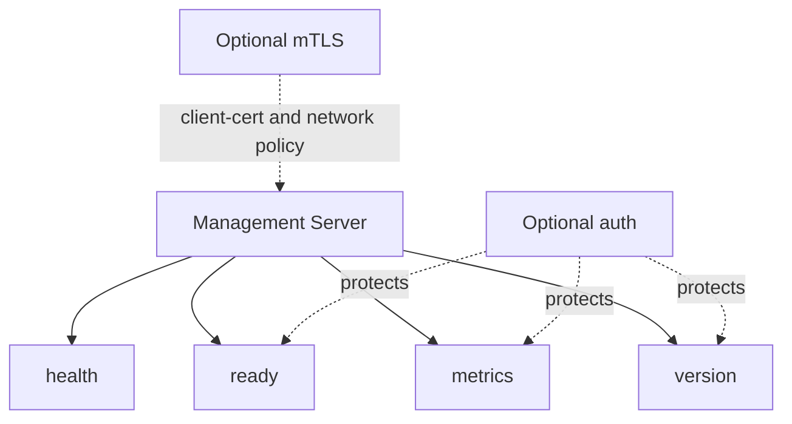

# Nimburion Operations

Operational runbook for services built on Nimburion.

## Prerequisites
- Go toolchain installed
- Service config file (optional but recommended)
- Environment overrides with `APP_` prefix

## Common Commands
Run tests:
```bash
go test ./...
```

Run tests with coverage:
```bash
go test -cover ./...
```

Build project:
```bash
go build ./...
```

## Operational Lifecycle


## Management Endpoints
Typical management endpoints:
- `/health`
- `/ready`
- `/metrics`
- `/version`

Expose them on the management server and secure them with auth/mTLS as needed.

## Endpoint Security Model


## Deploy and Config Rules
- Keep precedence fixed: `ENV > file > defaults`
- Avoid committing secrets; use secret managers or environment injection
- Keep public and management ports distinct
- Apply auth settings consistently between public and management surfaces
- Enable tracing/metrics in non-local environments by default

## Related pages
- [Index](./index.md)
- [Overview](./overview.md)
- [Architecture](./architecture.md)
