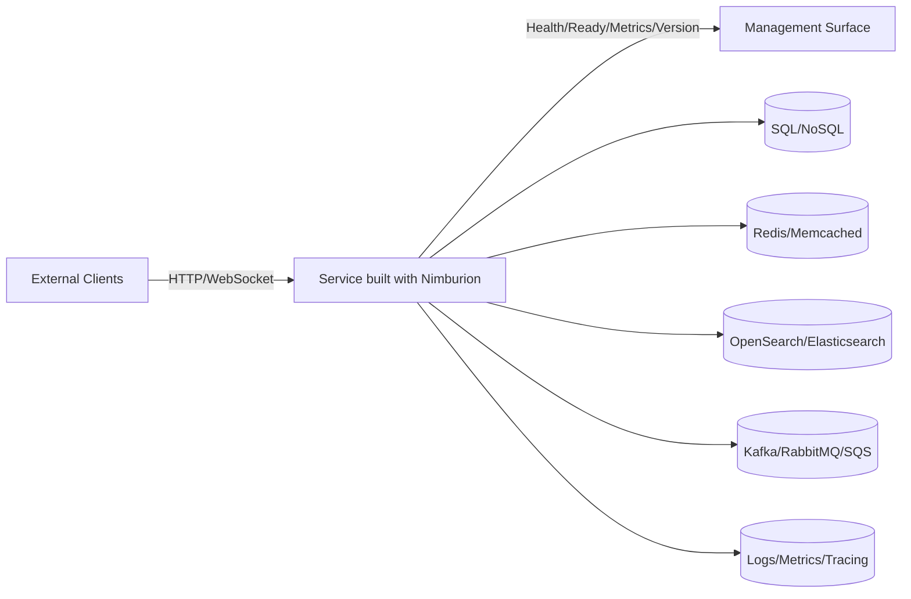
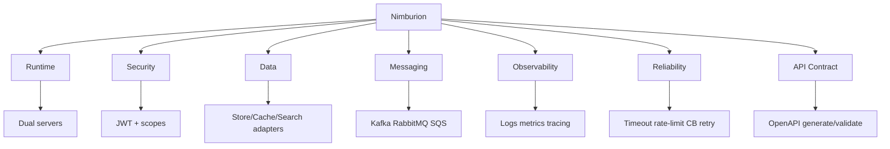

# Nimburion Overview

Nimburion is a reusable Go framework for building production-grade microservices with consistent architecture and operations.

## Objectives
- Reduce service bootstrap time and repeated boilerplate
- Standardize runtime behavior across teams
- Keep security, observability, and reliability first-class

## Use Cases
- Greenfield microservices that need production defaults from day one
- Existing services being aligned to shared platform contracts
- Platform teams exposing reusable infrastructure building blocks

## System Context

## Capability Matrix
| Area | What Nimburion provides |
| --- | --- |
| Runtime | Public + management servers, graceful shutdown |
| Security | OAuth2/OIDC JWT validation, scope authorization, security middleware |
| Data | Pluggable adapters for SQL/NoSQL, cache, search |
| Messaging | Event bus adapters (Kafka, RabbitMQ, SQS), outbox/idempotency helpers |
| Observability | Structured logging, metrics, tracing, health/readiness endpoints |
| Reliability | Timeout, rate limit, circuit breaker, retry patterns |
| API Contract | OpenAPI generation and request validation |

## Capability Map

## Related pages
- [Index](./index.md)
- [Architecture](./architecture.md)
- [Operations](./operations.md)
